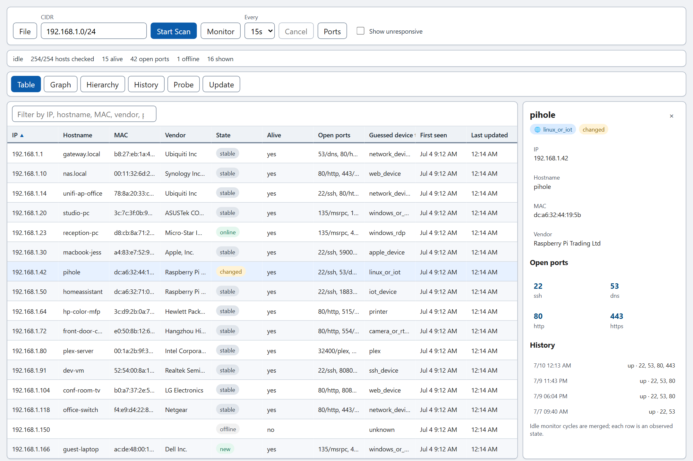
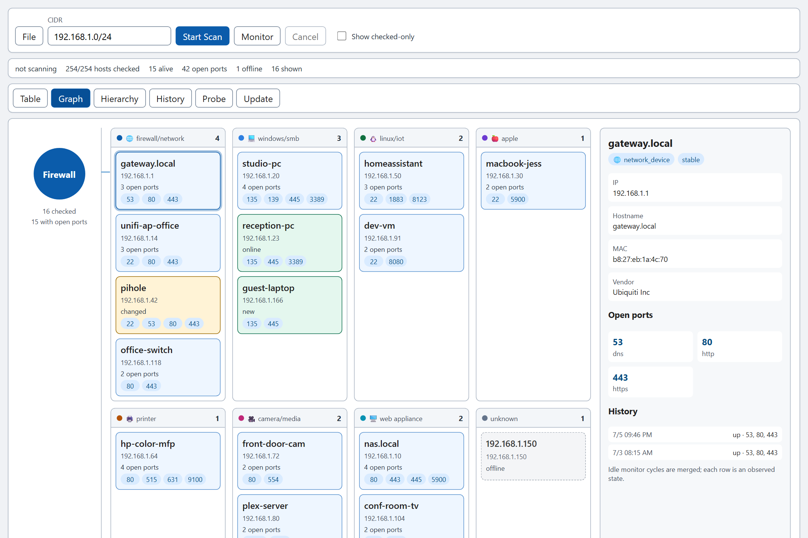
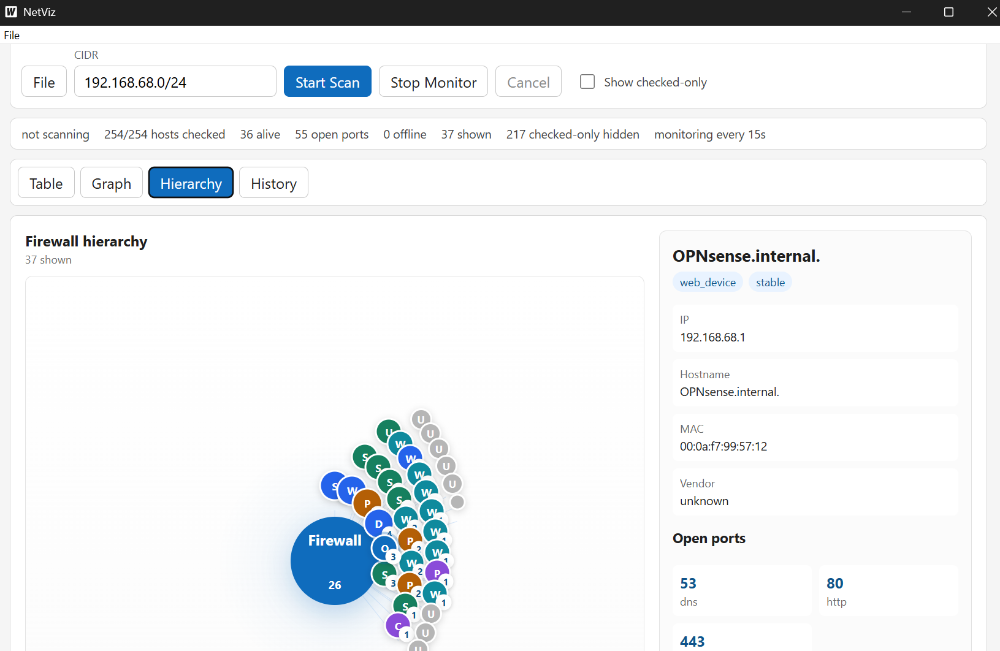
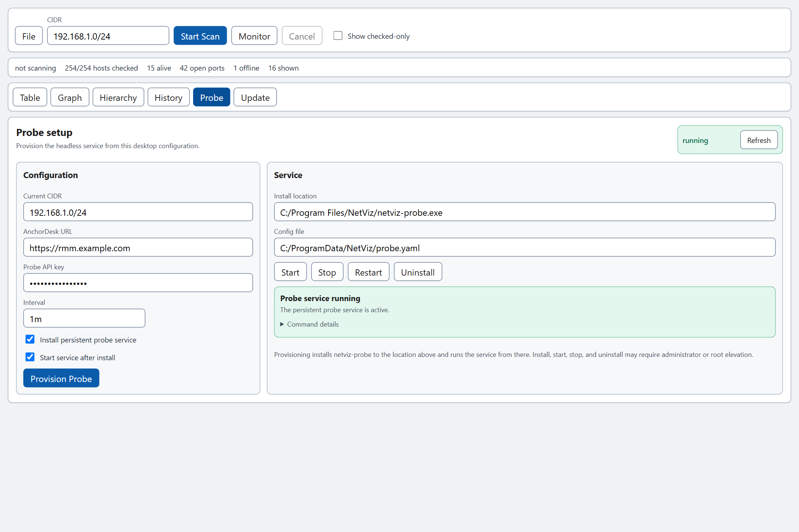
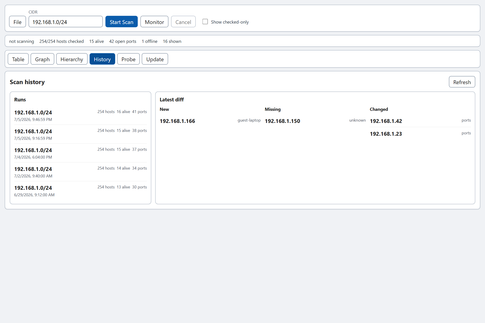

# NetViz


**See everything on your local network — in seconds, with one download.**

NetViz is a free, open-source LAN scanner and network visualizer for Windows and
Linux. Point it at your network, hit scan, and watch devices appear live as a
table, a grouped graph, and a clickable map. Leave it running and it tells you
what changed: new devices, devices that went offline, devices whose ports moved.

It's a modern take on tools like Advanced IP Scanner and Angry IP Scanner, built
on a fast native Go scan engine.

No agents. No accounts. No Nmap. Just download and run.

> **Authorized use only.** Scan networks you own or have explicit permission to
> scan.

**Current release: v1.0.0.** Windows builds are code-signed.

---

## Download

Grab the latest build from the
**[Releases page](https://github.com/Spillers-Technology/netviz/releases/latest)**.
There's nothing to install and no toolchain to set up.

| Platform | Download | Run |
| --- | --- | --- |
| **Windows** | `netviz-<version>-windows-amd64.zip` | Unzip, run **`netviz.exe`** in the extracted folder |
| **Linux** | `netviz-<version>-linux-amd64.tar.gz` | Extract, then run **`./netviz/netviz`** |

Each archive also bundles the `netviz-cli` command-line scanner, the headless
`netviz-probe`, and a SHA-256 checksum file to verify your download.

**macOS:** there's no prebuilt macOS download yet. NetViz builds from source on
macOS (see [For developers](#for-developers)); signed, notarized macOS builds
are deferred.

### Is it safe to run?

- **Windows builds are signed.** `netviz.exe` and the bundled tools carry an
  Authenticode signature with a trusted timestamp. Check it yourself:
  `Get-AuthenticodeSignature .\netviz.exe | Format-List Status, SignerCertificate`
  should report `Valid`. SmartScreen may still show "Windows protected your PC"
  for a newly published app until it builds reputation; choose **More info → Run
  anyway**.
- **Linux builds are not signed.** Verify the download against its `.sha256`
  file, and make sure the binary is executable: `chmod +x netviz/netviz`. The
  desktop app needs GTK 3 and WebKitGTK 4.1 (`libwebkit2gtk-4.1`).
- **Your data stays local.** Scan history lives in a SQLite database in your
  user config directory. It holds network inventory, not credentials. NetViz
  scans only the range you enter. Beyond that it contacts GitHub to check for
  updates, and the server you configure if you run a probe.

---

## Quick start

1. Launch **NetViz**.
2. Enter the network to scan as a CIDR, such as `192.168.1.0/24`.
3. Click **Start Scan**. Devices stream in as they're found.
4. Switch between the **Table**, **Graph**, and **Hierarchy** tabs to look at the
   same scan three ways.
5. Click **Monitor** to re-scan on the interval you pick and flag what changes.
   The **History** tab keeps past scans so you can compare them.

<p>
  
  
</p>

---

## What you get

- **Live discovery.** Enter a CIDR and NetViz TCP-connect scans a focused set of
  common LAN ports while results stream in. No raw packets, no SYN scans, no
  special drivers.
- **Three views of one scan.**
  - **Table:** IP, hostname, MAC, vendor, alive status, open ports, guessed
    device type, and first-seen and last-updated times.
  - **Graph:** devices grouped by inferred category, with open-port badges.
  - **Hierarchy map:** a firewall at the center with clickable device circles
    around it, built to stay readable on a `/24`.
- **Monitor mode.** Re-scans on an interval and marks every device **new,
  online, offline, changed,** or **stable**, so you can watch the network move.
- **Names and vendors.** Hostname resolution plus MAC and vendor lookup (IEEE
  OUI) from your local ARP cache.
- **History you can diff.** Completed scans are saved locally, with per-device
  history. Pick any two runs to see which devices are new, missing, or changed.
- **Save, open, export.** Keep scans as NetViz JSON and reopen them later, or
  export to CSV from the File menu.
- **Updates that verify themselves.** The desktop app checks GitHub Releases,
  downloads on request, verifies the release checksum, and keeps the previous
  binary as a `.old` backup.

NetViz is intentionally focused. It is **not** an Nmap wrapper, vulnerability
scanner, credential tool, remote shell, or RMM platform. There's no remote
command execution.

---

## For IT teams and MSPs

The same scan engine runs without a desktop, so you can put NetViz on a customer
network and get a live device inventory back at your desk.

- **[Headless probe](#headless-probe)** runs unattended as a Windows service,
  systemd unit, or launchd daemon, scans on a schedule, and pushes what it finds
  to your backend. You can set one up from the **Probe** tab in the desktop app.
- **[Server mode](#server-mode)** collects probe data into a web UI with an
  interactive network map. Run it from Docker in one command, and put it behind
  SSO (OIDC) when it's exposed beyond a trusted LAN.
- **AnchorDesk** integration: probes push devices to an AnchorDesk backend so
  live device inventory shows up alongside tickets.




---

## Command line

Every release archive includes `netviz-cli`, which uses the same scan engine and
history store as the desktop app:

```sh
# Stream scan results as JSON
netviz-cli scan -cidr 192.168.1.0/24

# Save a scan to local history, then review it
netviz-cli scan -cidr 192.168.1.0/24 -save
netviz-cli history
netviz-cli diff
```

---

## Headless probe

`netviz-probe` is a headless build of the scanner for unattended use on a LAN.
It runs the same scan engine as the desktop app and CLI, then pushes the devices
it finds to an **AnchorDesk** backend or a `netviz-server`. A NetViz instance
deployed on a customer network can feed live device inventory into tickets.

```sh
# Scan once, push the results, then exit
netviz-probe -cidr 192.168.1.0/24 \
  -url https://rmm.example.com -key <probe-api-key> -once

# Run continuously: re-scan + push on an interval, with heartbeats in between
netviz-probe -cidr 192.168.1.0/24 -interval 60s \
  -url https://rmm.example.com -key <probe-api-key>

# Install the same configuration as an OS service (run as Administrator/root)
export NETVIZ_ANCHORDESK_URL=https://rmm.example.com
export NETVIZ_ANCHORDESK_KEY=<probe-api-key>
sudo --preserve-env=NETVIZ_ANCHORDESK_URL,NETVIZ_ANCHORDESK_KEY \
  ./netviz-probe install -cidr 192.168.1.0/24 -interval 60s
sudo ./netviz-probe start
sudo ./netviz-probe status
```

| Flag | Purpose |
| --- | --- |
| `-cidr` | IPv4 CIDR to scan (required) |
| `-url` | AnchorDesk base URL (or `NETVIZ_ANCHORDESK_URL`) |
| `-key` | Probe API key, sent as `X-Probe-Key` (or `NETVIZ_ANCHORDESK_KEY`) |
| `-interval` | Heartbeat / re-scan interval (default `1m`) |
| `-config` | Shared JSON config file for service/GUI-managed probes |
| `-once` | Scan once, push, and exit instead of running continuously |

Service commands are `install`, `start`, `stop`, `restart`, `status`, and
`uninstall`. The same binary registers a native Windows service, systemd unit,
or launchd daemon. Put the binary in its permanent location before installing
because the service registration points to that exact path.

The URL and key can come from the environment or from a shared config file. The
API key is issued once when an admin registers the probe in AnchorDesk. After
each scan the probe `POST`s its devices to `/probe/devices` (upsert-keyed, so
re-scans don't duplicate) and keeps itself marked online via periodic
`/probe/heartbeat`. A failed push is retried on the next cycle, not dropped. The
probe has no desktop, Wails, or UI dependencies.

See [PROBE_DEPLOYMENT.md](PROBE_DEPLOYMENT.md) for complete Windows, Linux, and
macOS GUI/CLI install, logging, upgrade, and troubleshooting instructions.

---

## Server mode

`netviz-server` accepts device pushes from `netviz-probe` (the same v1 wire
contract used for AnchorDesk) and serves the latest network state as a web UI
with an interactive canvas network map:

```sh
docker run -p 8080:8080 -e NETVIZ_INGEST_KEY=your-probe-key \
  -v netviz-data:/data ghcr.io/spillers-technology/netviz

# then point a probe at it
netviz-probe -url http://server-host:8080 -key your-probe-key -cidr 192.168.1.0/24
```

Probe endpoints are disabled until an ingest key is configured
(`-ingest-key` or `NETVIZ_INGEST_KEY`). Open `http://server-host:8080/?demo`
to preview the map with sample data before wiring a probe.

To require SSO sign-in for the web UI and read APIs, point the server at any
OIDC identity provider (Entra ID, Google, Keycloak, Authentik):

```sh
netviz-server -oidc-issuer https://login.example.com/realms/main \
  -oidc-client-id netviz -public-url https://netviz.example.com
# NETVIZ_OIDC_CLIENT_SECRET and NETVIZ_SESSION_SECRET via environment
```

Register `<public-url>/auth/callback` as the redirect URI with your IdP.
Without `-oidc-issuer` the server runs in trusted-LAN mode (no web sign-in)
and says so at startup. Probe endpoints always authenticate with the ingest
key; machines don't do SSO.

---

## Compatibility and semver

From v1.0.0, NetViz follows semantic versioning over these surfaces:

- **Probe wire contract v1** (`/probe/devices`, `/probe/heartbeat`,
  `X-Probe-Key`, shapes in `internal/anchordesk`): frozen; breaking changes
  bump the contract version on both ends together.
- **CLI flags** for `netviz-cli`, `netviz-probe`, and `netviz-server`:
  existing flags keep their meaning; removals are major-version events.
- **File formats**: saved scan JSON, CSV export, and the probe config file
  stay readable across minor versions.
- **SQLite history schema**: migrated in place on open; upgrading NetViz
  never loses local history.

Internal Go packages (`internal/...`) are **not** a supported API surface.
Security posture and threat model live in [SECURITY.md](SECURITY.md).

---

## For developers

You only need this section to develop NetViz or build it yourself. Most people
should just [download a release](#download).

**Prerequisites:** Go 1.25+, Node.js + npm, and the
[Wails v2](https://wails.io/) CLI.

On Linux distributions that ship only WebKitGTK 4.1 (Debian 13, Ubuntu 24.04+),
add `-tags webkit2_41` to `wails dev` and `wails build`.

```sh
# Run the desktop app in dev mode
npm ci --prefix desktop/frontend
cd desktop && wails dev

# Or produce a packaged build
make build-desktop
```

Other targets:

```sh
make test          # go test ./...
make lint          # go vet ./...
make build-cli     # native CLI scanner
make build-server  # netviz-server: probe ingest + web UI
make build-probe   # netviz-probe headless scanner (see "Headless probe" above)
make build-web     # rebuild the server web UI into internal/server/webdist
```

The SQLite history store uses the pure-Go `modernc.org/sqlite` driver, so no
CGO is required.

### Architecture

NetViz is built around one rule:

```text
ScanEngine -> EventBus -> Consumers
```

The scanner core (`internal/scanner`) has no dependency on Wails, React, the
HTTP server, storage, or UI code. Every view (table, graph, hierarchy, CLI
JSON, file export, and SQLite history) consumes the same typed event stream.

```text
Current consumers   Desktop table · grouped graph · hierarchy map
                    CLI JSON output · file save/open · CSV export
                    SQLite history + diff · monitor mode
                    netviz-probe AnchorDesk reporter
                    netviz-server ingest + web UI network map

Future consumers    websocket event streamer
```

### Docs screenshots

The product screenshots on the [GitHub Pages site](docs/index.html) and in this
README are captured from the real desktop frontend with mocked scan data; no
live network is required. To regenerate them after a UI change:

```sh
cd desktop/frontend && npm run dev          # serve the app on 127.0.0.1:5173
node docs/scripts/capture-desktop-media.mjs # writes docs/assets/view-*.png
```

The script injects a mock Wails bridge (Playwright `addInitScript`) and replays
a baseline + monitor scan, so the table, graph, hierarchy, history, probe, and
update views all render with realistic devices and monitor states. Playwright is
loaded from `PLAYWRIGHT_NODE_MODULES` if set; see the script header for the
one-time install hint.

---

## Release history

See [CHANGELOG.md](CHANGELOG.md) for what changed in each release,
[MILESTONES.md](MILESTONES.md) for the roadmap and acceptance criteria, and
[RELEASING.md](RELEASING.md) for the build and release process.

## License

MIT. See [LICENSE](LICENSE).

## Contributing

Issues and focused pull requests are welcome. Please read
[CONTRIBUTING.md](CONTRIBUTING.md) for authorized-use boundaries, local checks,
and platform-testing expectations.
